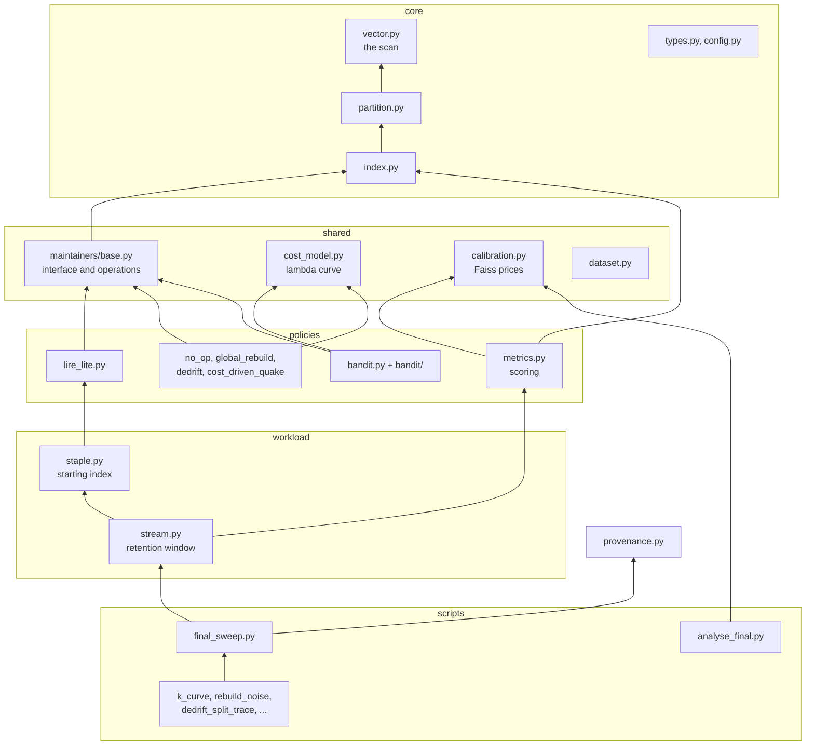
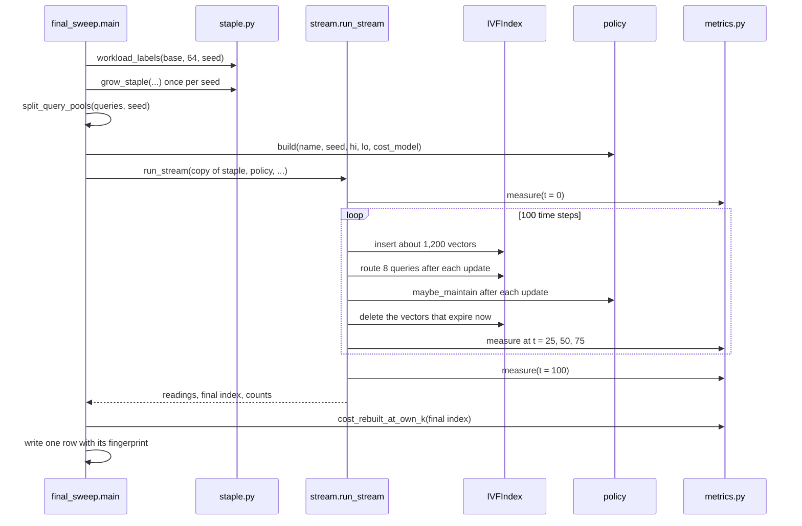
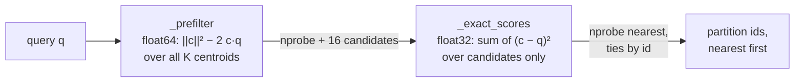

# Architecture

This document describes how the code is organised, how data moves through it during one run, and the data structures and algorithms the rest of the code is built on. The policies are described in [policies.md](policies.md), the scoring in [measurement.md](measurement.md), and the commands in [reproducing.md](reproducing.md). Terms are defined in [glossary.md](glossary.md).

## Contents

1. [Design principles](#design-principles)
2. [Module layers](#module-layers)
3. [One run, end to end](#one-run-end-to-end)
4. [The starting index](#the-starting-index)
5. [The stream](#the-stream)
6. [Partition](#partition)
7. [IVFIndex](#ivfindex)
8. [Routing](#routing)
9. [The policy interface](#the-policy-interface)
10. [Shared restructuring operations](#shared-restructuring-operations)
11. [Work accounting](#work-accounting)
12. [Determinism and reproducibility](#determinism-and-reproducibility)

## Design principles

The code is organised around one requirement: the maintenance policies must differ in their decisions and in nothing else. Five rules follow from it.

- **One index implementation.** Every policy runs on the same `IVFIndex`, so no policy gains from a faster or more careful data structure.
- **One starting point and one stream per seed.** Every policy of a seed starts from a copy of the same starting index and receives the same inserts, deletes and queries in the same order.
- **Shared operations.** Policies change the index only through the operations in `src/maintainers/base.py` and the `apply_*` methods of `IVFIndex`. Each operation records its own work, so two policies that take the same action pay the same price.
- **Measurement is separate from decision.** `src/metrics.py` and `src/calibration.py` compute the scored cost. No module under `src/maintainers/` or `src/bandit/` imports them, and the scoring never records query access, so measuring cannot change what a policy sees.
- **No clock in any reported number.** Query cost and work are counts of operations, priced afterwards with prices measured once and stored. A run gives the same numbers on a busy machine and an idle one.

## Module layers

Each module imports only modules in the layers below it.

| Layer | Module | Responsibility |
|---|---|---|
| core | `src/vector.py` | Distance arithmetic. `l2_distance_batch` is the scan of one partition for one query. |
| core | `src/partition.py` | One partition, its contiguous vector block, tombstones, centroid and access count. |
| core | `src/index.py` | The set of partitions, routing, inserts and deletes, and the `apply_split`, `apply_merge` and `apply_reassign` operations. |
| core | `src/types.py` | Plain data records, most importantly `MaintenanceReport`. |
| core | `src/config.py` | Constants, each with its source. |
| shared | `src/maintainers/base.py` | The `Maintainer` interface and the restructuring operations every policy shares. |
| shared | `src/cost_model.py` | The scan cost curve lambda(s) the Quake and bandit policies decide with. |
| shared | `src/calibration.py` | The measured Faiss prices that turn counts into query cost and work. |
| shared | `src/dataset.py` | Readers for SIFT1M and GIST1M, and exact ground truth. |
| policies | `src/maintainers/*.py`, `src/bandit/*.py` | The eight policy configurations, see [policies.md](policies.md). |
| policies | `src/metrics.py` | Ground truth over live vectors, the fixed recall search, the priced cost. |
| workload | `src/staple.py` | Grows the starting index of each seed under LIRE. |
| workload | `src/stream.py` | The retention window stream, the routed queries and the readings. |
| support | `src/provenance.py` | The fingerprint written with every result row. |
| scripts | `scripts/*.py` | The experiments, the analysis and the figures. |

`src/staple.py` imports `src/maintainers/lire_lite.py`, because the starting index of every policy is grown under LIRE. A change to `lire_lite.py` therefore changes the results of every policy, not only LIRE's, and the fingerprint treats it as shared code for that reason.

## One run, end to end

A run is one policy on one dataset under one seed. `scripts/final_sweep.py` executes it as follows.

1. **Load the dataset** with `load_sift1m` or `load_gist1m`.
2. **Label the workload clusters.** `workload_labels` assigns every base vector to one of 64 clusters, fitted with k-means on a sample of 100,000 vectors. The labels are stored in `data/workload_labels/` and reused.
3. **Grow the starting index** with `grow_staple`, once per seed, see [the starting index](#the-starting-index).
4. **Split the queries** with `split_query_pools` into a routed pool of 4,000, a sample of 400 from that pool, and 400 held out queries that are never routed.
5. **Build the policy** with `final_sweep.build`, which sets its parameters exactly as in the reported runs.
6. **Run the stream** with `run_stream`, on a deep copy of the starting index, see [the stream](#the-stream).
7. **Read the final index once more** with `cost_rebuilt_at_own_k`, a fresh k-means at the same K, see [measurement.md](measurement.md).
8. **Write one row** with every reading, the work counters and the fingerprint, then save the file. The file is saved after every run, so an interrupted set of runs loses at most the run in progress.

## The starting index

`src/staple.py`. The experiments do not start from an index built with k-means. Global k-means puts no limit on partition size, and on GIST, with about 100 vectors per partition in 960 dimensions, it leaves 14.6 percent of partitions below the merge threshold and the smallest with a single vector. A policy that merges small partitions would spend its first passes repairing the build. An index grown under a maintenance policy is bounded in both directions instead.

`grow_staple` works in four phases.

1. **Order the arrivals.** The rows of each workload cluster are shuffled with the seed. `clustered_runbook` produces the schedule of the NeurIPS 2023 Big ANN streaming track: five rounds, Dirichlet weights per cluster with one dominant round placed at random, inserts of each round followed by deletes in the same clusters.
2. **Bootstrap.** 5,000 vectors, spread evenly over the 64 clusters, are partitioned with k-means into 50 partitions, 100 vectors each on average.
3. **Grow.** The schedule is replayed with one delete per four inserts (`build_ratio` 4). LIRE maintains the index throughout, with a split threshold of 400 and a merge threshold of 50 (`target_avg` 100, `window` 8, the 80 to 10 ratio of SPFresh). Growth stops at 50,000 live vectors.
4. **Settle.** LIRE runs until a pass makes no split and no merge, at most 50 times.

The result is a `Staple`, which carries the index, the thresholds `hi` (400) and `lo` (50), the random generator in the state construction left it, the per cluster arrival order and cursor, and the age ordered list of live vectors. The stream continues from this exact state, which is why the generator is passed on rather than reseeded.

A grown starting index has about 170 to 185 partitions.

## The stream

`src/stream.py`, function `run_stream`. Default parameters, which are those of the reported runs:

| Parameter | Value | Meaning |
|---|---|---|
| `max_t` | 100 | time steps |
| `measure_ops` | 120,000 | inserts over the run, so about 1,200 per step |
| `width` | 3.0 | standard deviation, in clusters, of the arrival position around the current one |
| `query_ratio` | 8 | routed queries after every insert and every delete |
| expiry lag | `max_t // 2` = 50 | steps between a batch's arrival and its deletion |

At each step `t`:

1. **Choose the arrival cluster.** The walk over the 64 clusters is a permutation drawn from the seed. The current position is `t / 99` of the way along it, plus Gaussian noise of `width` clusters.
2. **Insert** about 1,200 vectors from that cluster, in its shuffled order. If the cluster is exhausted the next one in sequence is used. Every insert is followed by 8 routed queries and a call to `maybe_maintain`.
3. **Schedule expiry.** The batch is scheduled for deletion 50 steps later. Batches arriving after step 49 are still live at the end.
4. **Delete** the vectors due at this step, each followed by 8 routed queries and `maybe_maintain`. The starting index is spread over the first 50 steps by `sliding_window_cohorts`, oldest first.
5. **Read** the scoring at steps 25, 50 and 75.

A run makes about 120,000 inserts and about 110,000 deletes. The live count rises from 50,000 to about 60,000 over the first half and stays near it.

The routed queries are drawn from the routed pool with their own generator (`seed + 7`), so routing never changes the arrivals. They are served at the nprobe that reaches recall 0.9 on a fixed sample of 100 routed queries, recalibrated every 1,000 updates by `recall_matched_nprobe`. At a fixed nprobe a finer index would always look cheaper, because the recall it loses would not be counted, and the access counts the policies read would carry that bias.

The order of random draws in `run_stream` matters. The second draw, a shuffle of `_order`, is never read, but it advances the generator, and removing it would change every arrival.

## Partition

`src/partition.py`, class `Partition`.

| Attribute | Type | Meaning |
|---|---|---|
| `centroid` | float32 array | the routing representative |
| `_buf` | float32 matrix | the stored vectors, one row each, with spare capacity |
| `_n` | int | rows in use |
| `vector_ids` | list | the id of each row, in row order |
| `_id_to_pos` | dict | id to row, deleted ids included |
| `tombstones` | set | ids deleted but still stored |
| `access_count` | float | routed queries that probed this partition in the current window |
| `_live_rows`, `_live_ids` | cache | the live rows and ids, rebuilt after any change |
| `_cached_true_mean`, `_dirty` | cache | the mean of the live vectors, valid while not dirty |
| `_radius` | float | an upper bound on the distance from the centroid to any live vector |

**Storage.** Vectors are rows of one contiguous block, as in Quake. When it fills, `_ensure_capacity` doubles it, with a minimum of 8 rows, so a series of appends costs constant time per append on average.

**Sizes.** `size()` is the number of live vectors, stored minus tombstoned. `total_size()` is the number of stored vectors. Every size rule reads `size()`, except two rules of LIRE that read the stored length as SPFresh does.

**Deletes.** `mark_deleted` adds the id to `tombstones` and returns. Nothing moves and no work is charged. `compact` later gathers the live rows into a new block of exactly the right size, at a cost proportional to the stored length. `add` of an id that is currently a tombstone overwrites its row and revives it.

**Reading vectors.** `get_live_vectors()` returns `(ids, vectors)` as an independent copy that a caller may keep. `_live_block()` returns `(vectors, ids)`, in the opposite order, as a view into the storage when nothing is tombstoned. Only the scan uses it, and it must not be kept across a change.

**Drift.** `true_mean()` is the mean of the live vectors, cached until the partition changes. `centroid_drift()` is the distance from the centroid to that mean, zero for an empty partition.

**Access.** `record_access()` adds one. `decay_access(factor)` multiplies, which the bandit uses each pass. The Quake policy instead resets the count to zero at the end of each pass.

## IVFIndex

`src/index.py`, class `IVFIndex`.

| Attribute | Meaning |
|---|---|
| `partitions` | dict from partition id to `Partition` |
| `vector_to_partition` | dict from live vector id to partition id |
| `next_partition_id` | ids are never reused, every new partition gets the next one |
| `data_scale` | the norm of the per dimension standard deviation of the first build, about 387 on SIFT and 1.417 on GIST |
| `queries_routed` | routed queries in the current window, the denominator of the access fraction |
| `vectors_scanned_routed` | the live sizes of every partition a routed query probed, summed, used by the Quake policy |
| `_centroid_matrix`, `_centroid_matrix64`, `_centroid_sq_norms` | cached centroid matrices, cleared by `_invalidate_cache` after any change |

**Build.** `build` runs exact k-means (`_lloyd_partition`, scikit-learn `KMeans` with 25 iterations and one initialisation, the Faiss defaults) and fills the partitions. It records the number of distance evaluations the k-means made, which the global rebuild charges as work. `data_scale` is measured only on the first build, so a drift threshold means the same thing for a whole run.

**Insert and delete.** `insert` routes the vector to the nearest centroid and appends it. `delete` tombstones it in its partition and removes it from `vector_to_partition`.

**Structural changes.**

- `apply_split(pid, children)` removes the parent and adds the children under new ids. Each child is credited 0.86 of the parent's access count (`SPLIT_ACCESS_ALPHA`), so the pair holds 1.72 times the parent. This matches what was measured: about 48 percent of the queries that probed a parent probe both children afterwards.
- `apply_merge(pids, merged)` removes the listed partitions and adds the merged one under a new id.
- `apply_reassign(vid, from, to)` moves one vector and an equal share of the source's access count, the count divided by the source's live size.
- `recompute_centroid(pid)` moves a centroid to its partition's mean and returns the drift closed.

## Routing

Routing selects the nprobe partitions whose centroids are nearest to a query. It runs on every insert, every routed query and every scoring query, so it is the second most frequent operation after the scan.

1. **Prefilter.** The squared distance equals the squared centroid norm, minus twice the dot product, plus the squared query norm. The last term is the same for every centroid, so the first two rank the centroids correctly. With the norms cached, this is one matrix vector product in float64. It keeps nprobe plus 16 candidates.
2. **Exact.** The candidates are scored again as a plain implementation would score them, subtract then sum the squares in float32, and the nprobe nearest are kept, ordered by distance with ties broken by partition id.

The prefilter only proposes candidates. Ranking directly on the expanded form in float32 picked the wrong partition at some near ties on GIST, because the two large terms cancel. In float64 the error is around 1e-16, which the 16 spare candidates absorb, and the final choice is always the plain float32 one. The result is the same partitions as a plain implementation, about eight times faster.

There are two kinds of query.

| Method | Used by | Scans vectors | Records access |
|---|---|---|---|
| `route(q, nprobe)` | the stream's 8 queries per update | no | yes |
| `search(q, k, nprobe, record_access=False)` | the scoring | yes, returns the k nearest | no |

`search_adaptive`, a per query adaptive nprobe with a geometric stopping bound, exists in the index but is not used by the reported runs.

## The policy interface

`src/maintainers/base.py`, class `Maintainer`.

| Method | Called by | Purpose |
|---|---|---|
| `start(index, step)` | the stream, once | Marks the update count at which the stream takes over, so counters ignore the growth of the starting index. |
| `maybe_maintain(index, step)` | the stream, after every update | Returns at once unless `check_interval` (1,000) updates have passed since the last check. Otherwise calls `should_maintain` and, if true, `maintain`, and adds the report to the running totals. |
| `should_maintain(index, step)` | `maybe_maintain` | The policy's trigger. |
| `maintain(index)` | `maybe_maintain` | One maintenance pass. Returns a `MaintenanceReport`. |

The running totals (`_cumulative_work`, `_cumulative_splits` and the others) are what the result row reads at the end of the run.

## Shared restructuring operations

All in `src/maintainers/base.py`. Each takes the current report as `meter` and adds the distances it computes.

| Function | What it does | Used by |
|---|---|---|
| `split_partition_2means` | 2-means with scikit-learn, 3 starts, returns the children | LIRE, bandit |
| `merge_partitions` | joins partitions into one centred on the mean of all their vectors | bandit, DeDrift Split |
| `merge_into_survivor` | appends the shorter partition to the longer, which keeps its centroid | LIRE |
| `plan_partition_deletion` | plans where each vector of a partition would go if it were deleted, each to its nearest other partition | Quake |
| `apply_partition_deletion` | carries out such a plan | Quake |
| `collect_empty_partitions` | removes partitions with no live vectors, keeping at least one | LIRE, Quake, bandit |
| `reassign_lire_after_split` | the two LIRE conditions of SPFresh section 3.3, then moves checked vectors to their nearest local centroid | LIRE |
| `reassign_lire_after_merge` | reconsiders a moved vector only when the surviving centroid is farther than its old one | LIRE |
| `reassign_boundary` | moves every vector of a set of partitions to its nearest centroid among them | Quake refinement, bandit split |
| `top_k_nearest_partitions` | the k nearest partitions to a point, unordered | LIRE, Quake, bandit |
| `nearest_partitions_in_order` | the k nearest, nearest first | LIRE and bandit merge partner search |
| `drift_limit` | a drift threshold as a fraction of the data scale | bandit |
| `kmeans_distance_evaluations` | the distance evaluations a fitted scikit-learn KMeans made | every k-means call |
| `balance_constrained_assignment` | the balanced split of SPANN, switched off by `BALANCED_SPLIT` | none in the reported runs |

## Work accounting

`MaintenanceReport` in `src/types.py` collects what one pass did. Work has four parts, kept apart because each is priced differently, see [measurement.md](measurement.md).

| Field | Counts | Charged by |
|---|---|---|
| `vectors_processed` | vectors read, copied or averaged | every operation that touches vectors |
| `distance_evaluations` | distances between a vector and a centroid, outside k-means | reassignment, neighbour search, deletion planning |
| `kmeans_distance_evaluations` | distances inside small k-means | splits, DeDrift Split |
| `bulk_kmeans_distance_evaluations` | distances inside a full rebuild | global rebuild |
| `compaction_reads` | the part of `vectors_processed` spent on compaction | LIRE, bandit |

Deciding whether to act is not charged, with two exceptions in the bandit. Finding a merge partner compares the partition with every centroid, and reading the drift of a changed partition recomputes its mean. Without these charges a bandit that considers every partition would make about K squared distance computations per pass for free.

The report also counts actions: `num_splits`, `num_merges`, `num_reassigned` (single vectors moved), `num_repartitioned` (vectors moved by a wholesale repartition), `num_collected` (empty partitions removed), `num_centroids_recomputed`, `num_splits_declined` and `num_merges_declined` (rejected by an exact check), `num_forced_merges` and `num_examined`.

## Determinism and reproducibility

- **Seeds.** Every random choice comes from a numpy generator seeded from the run's seed, with fixed offsets for separate purposes: `seed + 7` for the routed queries, `seed + 11` for the scoring sample, `seed + 13` for the query split, `seed + 17` for the routing calibration sample, `seed + 19` for the query region centre. No policy draws from these generators, so every policy of a seed sees the same stream whatever it decides.
- **Threads.** `final_sweep.py` sets `OMP_NUM_THREADS`, `MKL_NUM_THREADS` and `OPENBLAS_NUM_THREADS` to 1 before numpy is imported. k-means over many vectors gives different results at different thread counts.
- **No clock.** No reported quantity is a measured time. Prices were measured once and are read from `results/cost_model/`.
- **Library versions.** A different scikit-learn can give a different k-means, so `requirements.txt` pins the versions used.
- **Fingerprints.** Every result row carries a fingerprint of the code, the prices, the machine, the library versions, the thread settings and the parameters, see [measurement.md](measurement.md#fingerprints).

With the same code, versions and parameters, a run reproduces every column exactly.
